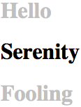
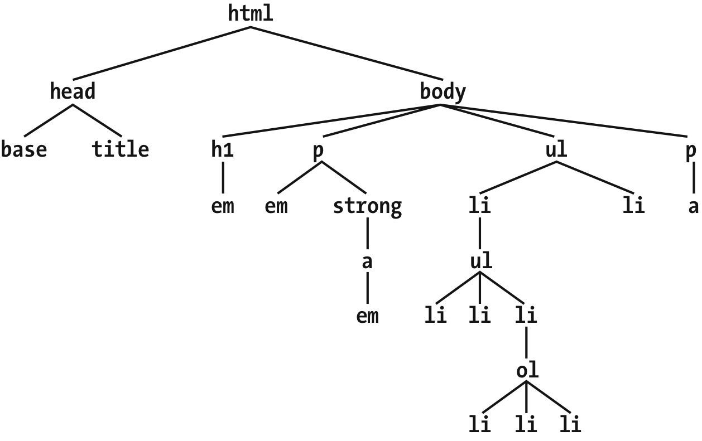
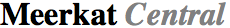
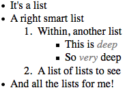
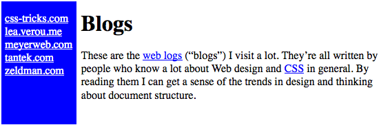
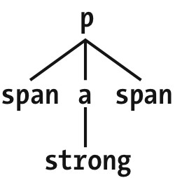
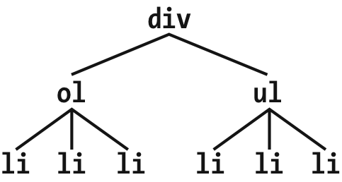
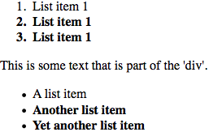
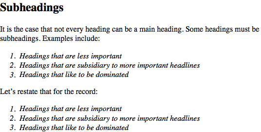

第02章  选择器


### 2.1.1 元素选择器

元素选择器通常都是 HTML 元素，但也有例外。例如，如果 CSS 文件的样式是用于 XML 文档的，元素选择器可能会是这样：

```css
quote {
  color: gray;
}
bib {
  color: red;
}
booktitle {
  color: purple;
}
myElement {
  color: red;
}
```

## 2.2 分组

### 2.2.1 群组选择器

如果你想让`h2`元素和段落都显示灰色文本，最简单的方式是使用下面的声明：

```css
h2,
p {
  color: gray;
}
```

把`h2`和`p`选择器放置在规则左边并用逗号分隔，这种方式定义了一条把右边样式（`color: gray;`）应用于两个选择器的规则。逗号告诉浏览器规则里面是两个不同的选择器，如果去掉逗号，会使语句变成另外一条含义完全不同的规则。（参见后面的章节“后代选择器”。）

## 2.3 类和 ID 选择器

### 2.3.1 类选择器 Class Selectors

忽略元素类型应用样式的最常用方式，是使用类选择器。但是在使用它们之前需要设置文档标记，以便选择器能够生效。添加`class`属性：

```html
<p class="warning">When handling plutonium, care must be taken to avoid the formation of a critical mass.</p>
<p>
  With plutonium,
  <span class="warning">the possibility of implosion is very real, and must be avoided at all costs</span>. This can be
  accomplished by keeping the various masses separate.
</p>
```
现在只需要一种方式把样式应用在这些元素上。在 HTML 文档中，可同`class`名称紧跟一个句点（.），并且可以与元素选择器一起使用：
```css
.warning {
  font-weight: bold;
}
```

类选择器直接通过元素`class`属性中的值来引用元素。引用始终以句点（.）开头，标记它是一个**类选择器**。句点把类选择器和与其组合在一起的其他部分区分开来（例如元素选择器）。假如当只有整个段落是警告时，才设置为粗体：

```css
p.warning {
  font-weight: bold;
}
```

### 2.3.3 ID选择器

从某些方面说，ID 选择器和类选择器类似，但它们有一些重要区别。首先，ID 选择器使用井号（`#`）开头，一条规则可能是这样的：

```css
*#first-para {
  font-weight: bold;
}
```

这条规则为任意`id`属性值为`first-para`的元素设置文本粗体。

第二个区别是 ID 选择器（理所当然地）查找`id`属性而不是`class`属性的值。这是一个 ID 选择器生效的例子：

```css
*#lead-para {
  font-weight: bold;
}
```

```html
<p id="lead-para">This paragraph will be boldfaced.</p>
<p>This paragraph will NOT be bold.</p>
```

注意值`lead-para`可以关联给文档中的任意元素。在这个例子中，它只赋给了第一个段落，但是你可以同样赋给第二个、第三个段落。

As with class selectors, it is possible to omit the universal selector from an ID selector. In the previous example, we could also have written:

和类选择器一样，ID 选择器中的通配选择符可以忽略。上例也可以写成这样：

```css
#lead-para {
  font-weight: bold;
}
```

效果是一样的。

## 2.4 属性选择器 Attribute Selectors

当你使用类和 ID 选择器时，实际上是在选择属性的值。类选择器和 ID 选择器专用于 HTML、XHTML、SVG 和 MathML 文档（到撰写本文时），但在其它的标记语言中，这两个选择器可能是不可用的（属性可能不存在）。因此，CSS2 引入了**属性选择器**，使用元素的任意属性和值来选择元素。属性选择器有四种基本类型：简单属性选择器、准确属性值选择器、部分匹配属性选择器和头值属性选择器。

### 2.4.1 简单属性选择器 Simple Attribute Selectors

```css
h1[class] {
  color: silver;
}
```

对如下代码：

```html
<h1 class="hoopla">Hello</h1>
<h1>Serenity</h1>
<h1 class="fancy">Fooling</h1>
```

you get the result shown in Figure 2-9.

将得到如图 2-9 的结果：

<div style="margin: 0 auto; width: 50%;">
    
</div>
<p align="center">图 2-9：使用属性选择元素</p>

### 2.4.3 基于部分属性值选择 Selection Based on Partial Attribute Values

你可能想基于属性值的一部分而不是整个值来选择元素，这种情况下 CSS 提供了一些选择，匹配属性值中的子串。它们总结在表格 1-1 中。

_表格 1-1：子串匹配属性选择器_

| 类型                | 描述                                                         |
| :------------------ | :----------------------------------------------------------- |
| `[foo~="bar"]`      | 选择所有带有`foo`属性、且`foo`属性被空白分隔的单词列表中含有单词`bar`的元素。 |
| `[foo*="bar"]`      | 选择所有带有`foo`属性、且`foo`属性值中含有子串`bar`的元素。  |
| `[foo^="bar"]`      | 选择所有带有`foo`属性、且`foo`属性值以`bar`开头的元素。      |
| `[foo$="bar"]`      | 选择所有带有`foo`属性、且`foo`属性值以`bar`结束的元素。      |
| `[foo&#124;="bar"]` | 选择所有带有`foo`属性、且`foo`属性值以`bar`开头后接一个短线（`U+002D`）或者属性值是`bar`的元素。 |

## 2.5 使用文档结构 Using Document Structure

为了理解选择器和文档之间的关系，我们要再次回顾文档结构是如何组织的，看下面这个非常简单的 HTML 文档：

```html
<html>
  <head>
    <base href="http://www.meerkat.web/" />
    <title>Meerkat Central</title>
  </head>
  <body>
    <h1>Meerkat <em>Central</em></h1>
    <p>
      Welcome to Meerkat <em>Central</em>, the
      <strong
        >best meerkat web site on <a href="inet.html">the <em>entire</em> Internet</a></strong
      >!
    </p>
    <ul>
      <li>
        We offer:
        <ul>
          <li><strong>Detailed information</strong> on how to adopt a meerkat</li>
          <li>Tips for living with a meerkat</li>
          <li>
            <em>Fun</em> things to do with a meerkat, including:
            <ol>
              <li>Playing fetch</li>
              <li>Digging for food</li>
              <li>Hide and seek</li>
            </ol>
          </li>
        </ul>
      </li>
      <li>...and so much more!</li>
    </ul>
    <p>Questions? <a href="mailto:suricate@meerkat.web">Contact us!</a></p>
  </body>
</html>
```

CSS 的能力很大程度基于于元素的**父-子关系**。HTML 文档（事实上绝大部分结构化文档）基于元素层级结构，构成文档的“树状”视图（见图 1-15）。在这种层级结构中，每个元素都处在整个文档结构中的某个适当位置上，每个元素都是其他元素的**父**或者**子**，常常既是父又是子。

<div style="margin: 0 auto; width: 50%;">
    
</div>
<p align="center">图 2-15：文档树结构</p>

在文档层级结构中，如果一个元素在另一个元素的紧邻的上方，就被称作那个元素的父元素。例如，在图 2-15 中，第一个`p`元素是`em`和`strong`元素的父元素，同时`strong`是一个锚点（`a`）元素的父元素，这个`a`元素又是另一个`em`元素的父元素。反过来，如果在文档层级中，一个元素在另一个元素的紧邻的下方，就被称作那个元素的子元素。因此，图 1-15 中的锚点元素是`strong`元素的子元素，`strong`元素又是`p`元素的子元素，等等。

### 2.5.2 后代选择器 Descendant Selectors

理解文档模型的第一个用处是可以定义**后代选择器**（也叫做**上下文选择器**）。定义后代选择器可以创建只作用于特定结构的规则。例如，如果想要只为那些是`h1`元素的后代的`em`元素设置样式。你可以为`h1`中的`em`元素添加一个`class`属性，但这样做会跟使用`font`标签一样耗费时间。很明显，声明一个只匹配`h1`元素中的`em`元素的规则更加方便。

实现这个规则，可以这样写：

```css
h1 em {
  color: gray;
}
```

这条规则会把所有是`h1`元素后代的`em`元素中的文本设置为灰色。其他的`em`文本，例如在段落（`p`）或引用（`blackquote`）中的`em`元素，不会被这条规则选择。见图 1-16。

<div style="margin: 0 auto; width: 50%;">
    
</div>
<p align="center">图 2-16：基于上下文选择元素</p>


在后代选择器中，选择器由两个或更多空白分隔的选择器组成。选择器之间的空格是一个**组合器**的例子。每个空格组合器都可以被译作“在……中”、“是……的一部分”或“是……的后代”，前提是选择器从右向左读。因此，`h1 em`可以被译作“把样式作用于任何`em`元素，如果它是`h1`元素的后代”。（如果选择器从左向右读，则是：“选择任何`h1`，如果它包含一个`em`元素，规则将会作用于它包含的`em`”）。

可以使用不止两个选择器，例如：

```css
ul ol ul em {
  color: gray;
}
```

In this case, as Figure 2-17 shows, any emphasized text that is part of an unordered list that is part of an ordered list that is itself part of an unordered list (yes, this is correct) will be gray. This is obviously a very specific selection criterion.

在这种情况下，任何`em`文本，如果这个`em`在一个`ul`中，同时`ul`在一个`ol`中，而`ol`又在另一个`ul`中，这个`em`会被设置为灰色,如 2-17 所示。这是一条非常具体的选择规则。

<div style="margin: 0 auto; width: 50%;">
    
</div>
<p align="center">图 2-17：一个非常具体的后代选择器</p>

Descendant selectors can be extremely powerful. They make possible what could never be done in HTML—at least not without oodles of font tags. Let’s consider a common example. Assume you have a document with a sidebar and a main area. The sidebar has a blue background, the main area has a white background, and both areas include lists of links. You can’t set all links to be blue because they’d be impossible to read in the sidebar.

后代选择器非常有用，它使得 HTML 中（至少是不使用怪异的`font`标签时）办不到的事情变成可能。一个常见的场景是：如果文档中有一个侧边栏和一个主区域，侧边栏的背景是蓝色，而主区域的背景是白色，它们都包含链接。不能把链接设置为蓝色，因为如果这样的话，侧边栏中的链接就看不到了。

The solution: descendant selectors. In this case, you give the element that contains your sidebar a class of sidebar and enclose the main area in a main element. Then, you write styles like this:

解决方法是：后代选择器。在这种情况下，给包含侧边栏的元素（一般是一个`div`）添加一个`class`值`sidebar`，把主区域的`class`命名为`main`，然后使用如下样式：

```css
.sidebar {
  background: blue;
}
.main {
  background: white;
}
.sidebar a:link {
  color: white;
}
.main a:link {
  color: blue;
}
```

Figure 2-18 shows the result.

图 2-18 显示了样式的结果。

<div style="margin: 0 auto; width: 50%;">
    
</div>
<p align="center">图 2-18：使用后代选择器为同一类型的元素添加不同的样式</p>

_**`:link`选择那些尚未被访问过的资源链接，我们将在“超链接伪类”中详细讨论。**_

另一个例子是：如果要把所有在`blockquote`和`p`中的`b`元素文本设置为灰色：

```css
blockquote b,
p b {
  color: gray;
}
```

这条样式的结果是在段落或引用段落中的`b`元素中的文本显示为灰色。

后代选择器的一个容易被忽略的地方是，元素和后代元素之间可以间隔无限代其他元素。例如，如果使用规则`ul em`，将会选择`ul`元素后代中的任何`em`元素，无论`em`元素嵌套多么深。因此，对下面的代码，`ul em`会匹配到其中的`em`元素。

```html
<ul>
  <li>
    List item 1
    <ol>
      <li>List item 1-1</li>
      <li>List item 1-2</li>
      <li>
        List item 1-3
        <ol>
          <li>List item 1-3-1</li>
          <li>List item <em>1-3-2</em></li>
          <li>List item 1-3-3</li>
        </ol>
      </li>
      <li>List item 1-4</li>
    </ol>
  </li>
</ul>
```

后代选择器的另一个更微妙的地方是，它没有接近程度的概念。换句话说，文档树中两个元素的紧密程度与是否应用规则无关。这将会在考虑特异性（特度，在后面讨论）和元素规则之间的相互抵消时产生影响。

例如，考虑下面的代码（包含我们将会在本章“否定伪类”中讨论的选择器）：

```html
div:not(.help) span {color: gray;} div.help span {color: red;}

<div class="help">
  <div class="aside">This text contains <span>a span element</span> within.</div>
</div>
```

第一条规则表示“任何`class`中不包含单词`help`的`div`元素中的`span`元素被设置为灰色”，第二条规则表示“任何`class`中包含单词`help`的`div`元素中的`span`元素被设置为红色”。对示例中的 HTML 代码来说，两条规则都会被作用于`span`元素。

因为两条规则有相同的权重，且“红色”规则被写在后面，`span`会被设置为红色。虽然`div class="aside"`比`div class="help"`相比，与`span`元素更“紧密”，但实际上这种紧密程度与规则的选择毫不相关。亦即：后代选择器没有紧密程度的概念。两条规则都匹配了元素，只有一种颜色可以生效，根据 CSS 的工作方式，红色“胜利”了。（下一章讨论）

### 2.5.3 选择子元素 Selecting Children

有时，我们并不想选择全部的后代元素，而是把选择范围控制在元素的子级，例如选择一个是`h1`元素的子元素（而不是任意后代元素）的`strong`元素，这种情况下，可以使用子元素组合器，它是一个大于号（`>`）:

```css
h1 > strong {
  color: red;
}
```

这条规则将会把下面的第一个`h1`元素中的`strong`元素设置为红色，第二个`h1`元素中的`strong`元素则不会被设置为红色。

```html
<h1>This is <strong>very</strong> important.</h1>
<h1>
  This is <em>really <strong>very</strong></em> important.
</h1>
```

从右往左读，选择器`h1 > strong`可以译作“选择任何`strong`元素，如果它是一个`h1`元素的子元素”。子元素组合器两边可以添加空格, 你可以根据自己的爱好添加或省略空格，`h1 > strong`、`h1> strong`和`h1>strong`是完全等价的。

观察文档的树状结构视图，子元素选择器把匹配限制在直接连接的元素上。图 1-19 显示了部分文档树。

<div style="margin: 0 auto; width: 50%;">
    
</div>
<p align="center">图 2-19：一个文档树片段</p>

在这文档树片段中，可以很清楚的观察到父-子关系。例如，`a`元素是`strong`元素的父元素，同时是`p`元素的子元素。在这个片段中，可以使用`p > a`和`a > strong`选择元素，但无法使用`p > strong`选择元素，因为`strong`是`p`的后代元素但不是子元素。

在同一个选择器中可以结合使用后代选择器和子元素原则器。`table.summary td > p`选择是`td`元素子元素的`p`元素，同时这个`td`元素需要是一个`class`属性值包含`summary`的`table`元素的后代元素。

### 2.5.4 选择相邻兄弟元素 Selecting Adjacent Sibling Elements

假如想要为一个紧跟着标题的段落设置样式，或者给一个紧跟着段落的列表添加一个边距，可以使用**相邻兄弟组合器**来选择在同一个父级元素下紧跟着另一个元素的元素，组合器使用加号（`+`）。就像子级选择器一样，这个符号也可以在两边添加或省略空格。

移除一个紧跟`h1`元素的段落的上边距：

```css
h1 + p {
  margin-top: 0;
}
```

选择器读作：“选择任何紧跟在`h1`元素后面的`p`元素”。

看图 2-20 的文档树片段，更清晰地观察这个选择器是如何生效的：

<div style="margin: 0 auto; width: 50%;">
    
</div>
<p align="center">图 2-20：另一个文档树片段</p>

在这个片段中有两个列表都是`div`元素的后代，一个是有序列表，另一个是无序列表，每个都包含三个列表项。两个列表互为相邻兄弟，每个列表中的列表项也互为相邻兄弟，但第一个列表中的项与第二个列表中的列**不是**相邻兄弟，因为它们没有共同的父元素。（它们最多是表兄弟元素，但 CSS 没有表兄弟元素选择器。）

选择后面的两个相邻兄弟只需要一个组合器符号，如果写作`li + li {font-weight: bold;}`,只有每个列表中的第二项和第三项会被设置为粗体，样式不会对第一项生效。见图 2-21.

<div style="margin: 0 auto; width: 50%;">
    
</div>
<p align="center">图 2-21：选择相邻兄弟元素</p>

CSS 的正确性依赖于两个元素的“代码顺序“。在上面的例子中，一个`ol`元素后面紧跟着一个`ul`元素，因此可以使用`ol + ul`选择第二个（`ul`）元素，但不能选择第一个（`ol`）元素。如果想使`ul + ol`匹配，需要一个`ol`元素紧跟在一个`ul`元素后面。

需要记住，两个元素之间的文本内容**不会**影响相邻元素组合器。下面的代码片段，树视图与图 2-19 是一样的：

```html
<div>
  <ol>
    <li>List item 1</li>
    <li>List item 1</li>
    <li>List item 1</li>
  </ol>
  This is some text that is part of the 'div'.
  <ul>
    <li>A list item</li>
    <li>Another list item</li>
    <li>Yet another list item</li>
  </ul>
</div>
```

尽管两个列表之间有文本内容，选择器`ol + ul`依然会匹配第二个列表。因为文本并不包含一个兄弟元素，而是属于父元素`div`的一部分。如果把文本内容用一个段落元素（`p`）包起来，`ol + ul`匹配第二个列表的行为将会被终止。要匹配第二个列表，需要用`ol + p + ul`这样的选择器。

相邻兄弟组合器可以与其他组合器连接使用，例如：

```css
html > body table + ul {
  margin-top: 1.5em;
}
```

这个选择器是指：“选择任何紧跟`table`元素的兄弟`ul`元素，同时这个`table`元素是一个`body`元素的后代，而`body`元素是一个`html`的子元素。”

和所有组合器一样，相邻兄弟选择器可以用于很复杂的选择器中，如`div#content h1 + div ol`。这个选择器是：“选择任何是`div`元素后代的`ol`元素，同时这个`div`元素是一个`h1`元素的紧邻兄弟元素，而这个`h1`元素是一个`id`属性值为`content`的`div`元素的子元素。”

### 2.5.5 选择跟随兄弟元素 Selecting Following Siblings

Selectors Level 3 引入了一个新的兄弟组合器叫做**一般兄弟选择器**。这个组合器允许选择同一个父元素下，跟随（不一定是紧跟随）在某个元素后面的所有元素，使用波浪线符号（`~`）。

如下例，为同一个父元素下跟随在一个`h2`元素后面的任何`ol`元素设置斜体，可以写作`h2 ~ ol {font-style: italic;}`。两个`ol`元素不必都是紧邻兄弟，尽管是紧邻兄弟的话也会被这条规则匹配。效果见图 2-22.

```html
<div>
  <h2>Subheadings</h2>
  <p>
    It is the case that not every heading can be a main heading. Some headings must be subheadings. Examples include:
  </p>
  <ol>
    <li>Headings that are less important</li>
    <li>Headings that are subsidiary to more important headlines</li>
    <li>Headings that like to be dominated</li>
  </ol>
  <p>Let's restate that for the record:</p>
  <ol>
    <li>Headings that are less important</li>
    <li>Headings that are subsidiary to more important headlines</li>
    <li>Headings that like to be dominated</li>
  </ol>
</div>
```

<div style="margin: 0 auto; width: 50%;">
    
</div>
<p align="center">图 2-22：选择跟随兄弟元素</p>

如图所示，两个有序列表都是斜体，因为两个`ol`元素都在`h2`元素后面，且它们（三个）共有一个父元素（`div`）。

## 2.6 伪类选择器 Pseudo-Class Selectors

**伪类选择器**非常有趣，它们是一些根据元素状态变化而产生作用的幽灵类。伪类选择器可以根据某些确定元素的状态、文档中的标记模式甚至文档本身的状态选择元素并添加样式。

“幽灵类”的说法可能看起来有点怪，但这个词非常贴切地体现了伪类的工作方式。例如，假如你想要把一个数据表格每隔一行设置为高亮，你可以每隔一行在行元素上加一个`class="even"`，然后写一段 CSS 把`class`值有`even`的行设置为高亮。但是你也可以使用伪类选择器更简便地实现相同的效果，后面会很快看到它的用法。

### 2.6.1 组合伪类 Combining Pseudo-Classes

在开始之前，先提一下“链式”。CSS 允许（链式）组合伪类选择器，例如，当鼠标停留在（`hover`）一个未访问过的链接（`<a>`）上时，将其设置为红色，当鼠标停留在已经访问过的链接上时,将其设置为栗色：

```css
a:link:hover {
  color: red;
}
a:visited:hover {
  color: maroon;
}
```

（伪类的）顺序无关紧要，`a:hover:link`和`a:link:hover`的效果是一样的。同样的，可以为特定语言的不同状态的链接设置不同的样式，例如德语：

```css
a:link:hover:lang(de) {
  color: gray;
}
a:visited:hover:lang(de) {
  color: silver;
}
```

注意不要组合互斥的伪类，例如，一个链接不可能既是访问过的又是没访问过的，所以`a:link:visited`没有任何意义，它并不会匹配任何东西。

### 2.6.2 结构性伪类 Structural Pseudo-Classes

大部分伪类都是结构性的，既它们是与文档的标记结构相关的。大部分伪类由标签内的结构决定，例如某个伪类选择器选择（某个文档片段中的）第三个段落（`p`）。其他一些选择器允许你处理特定类型的元素。所有的伪类都以一个冒号（`:`）开头，没有例外，而且它们可以出现在选择器的任何位置。

在开始之前，关于伪类有一点需要明确：伪类永远只指向他们关联的元素，而不是其他元素。这点似乎非常明显而没有必要特意强调，之所以要明确它，是因为在实际使用中，有一些结构型伪类常常被错误地当成后代元素的描述符。

为了进一步说明这点，我想分享一则我个人的轶事。2003 年，我的大女儿，也是我的第一个孩子，出生了。我在网上公布了这个消息（就像你们会做的一样^\_^）。许多人回复我表示祝贺，并讲了一些 CSS 的小幽默，许多人用了选择器`#ericmeyer:first-child.`。问题是这个选择器选择的是我，而且只有当我是我父母的第一个孩子的时候才会选择我（巧了，我还真是）。如果要选择我的第一个孩子，选择器应该是`#ericmeyer > :first-child`。

这种混淆是可以理解的，这就是为何我会在这里提到它，后面的章节我们会经常想起它。只要记住，伪类的作用是给它们绑定的元素添加一些“影子类”，就不容易犯（前面的）错误了。


### 选择根元素 Dynamic Pseudo-Classes

这是结构简单性的精髓：伪类选择器`:root`选择文档的根元素。在 HTML 中，根元素**永远是**`html`元素。在为 XML 语言添加样式时，这个选择器会非常有用，因为在不同的语言中根元素可能不同。例如，在 RSS 2.0 中，根元素是`rss`。即使在一种语言（甚至是一个文档）里，也可能会使用不止一个根元素。

图 1-23 展示了一个给 HTML 中的根元素添加样式的例子：

```css
:root {
  border: 10px dotted gray;
}
body {
  border: 10px solid black;
}
```

_图 1-23：设置根元素样式_

当然，在 HTML 文档中，可以直接选择`html`元素，不需要使用`:root`伪类。这两个选择器在特度方面有差异，我们将在第 3 章讨论。

#### 选择空元素

使用伪类`:empty`，可以选择任何没有子节点的元素——没有任何类型的子元素：**包含**文本节点，包括文字和空白。这有助于筛除 CMS 生成的没有填进任何实际内容的元素。因此，`p:empty {display: none;}`将会让所有空的段落不再显示。

注意，一个元素如果要被`:empty`匹配，它必须（从解析的角度看）是真正空的——没有空白、可见内容，或后代元素。在下面的元素中，只有第一个和最后一个会被`p:empty`匹配。

```html
<p></p>
<p></p>
<p></p>
<p><!—-a comment--></p>
```

第二个和第三个段落不会匹配`:empty`，因为它们不是空的：它们各自包含一个空格和一个换行符，都会被当做文本节点，因此不是空状态。最后一个段落能够匹配，因为注释既不会被当成内容，也不会被当成空白。但是如果在注释的任何一侧添加一个空格或者换行，`p:empty`将不再匹配它。

你可能会试着为所有空元素设置样式，像这样：`*:empty {display: none;}`，但是这里有个潜在的陷阱：`:empty`会匹配 HTML 的空元素，如`img`和`input`，甚至会匹配`textarea`，除非你为`textarea`元素插入了一些默认文本。因此，从匹配元素的角度来说，`img`和`img:empty`是一样的（它们在特度上有区别，我们将在下一章讨论）。

```html

<br />
<input type="number" min="-1" max="1" step=".01" />
<textarea></textarea>
```

_**到 2017 年底，`:empty`是唯一一个在匹配元素的时候考虑文本节点的 CSS 选择器。所有 Selectors Level 3 的其他选择器都只考虑元素节点，而完全忽略文本节点——例如，前面讨论过的兄弟组合器**_

#### 选择唯一的子代

如果想选择待超链接的图像，可以使用：only-child伪类，他选择的元素是另一个元素的唯一子元素。

```css
img:only-child{border:1px solod black;}
```

#### 3. 选择第一个和最后一个子代

:first-child伪类选择一个元素的第一个子元素；

:last-child伪类选择一个元素的最后一个子元素。

#### 4. 选择第一个和最后一个某种元素

例如   ：选择元素中的第一个table，不管table前后有什么元素

```css
table:first-of-type {border-top:2px soild gray;}
```

#### 4 . 选择第n各子元素

nth-child(n):n为数字，例如：

```css
p:nth-child(2){font-weight:bold;}
li:nth-child(1){text-transform:uppercase;}
```

#### 5. 选择第n各某种元素

:nth-child( )

:nth-last-child( )

:nth-of-type( )

:nth-last-of-type( )

### 2.6.3 动态伪类

#### 1. 超链接伪类
| 类型   | 描述                                         |
| :----- | :------------------------------------------- |
| :link  | 指代用作超链接锚记（href），且尚未访问的地址 |
| :visit | 已访问的超链接地址                           |


#### 2. 用户操作伪类

| 类型   | 描述                   |
| :----- | :--------------------- |
| :focus | 当前获得输入焦点的元素 |
| :hover | 鼠标指针悬停在元素之上 |
| :active | 用户输入激活 |

#### 3. UI状态伪类

| 类型      | 描述                       |
| :-------- | :------------------------- |
| :enabled  | 可接受输入的元素           |
| :disabled | 不接受输入的元素           |
| :checked  | 默认选中的单选按钮或复选框 |
| :indeterminate  | 既没有选中，又没有不选中的 单选按钮或复选框，只能由DOM设定|
| :default  | 默认选中的单选按钮或复选框|
| :valid | 满足数据有效性的输入框 |
| :invalid | 不满足数据有效性的输入框 |
| :in-range | |
| :out-of-range | |
| :required | 必须输入的输入框 |
| :optional | 无需比输入的输入框 |
| :read-write | |
| :read-only | |