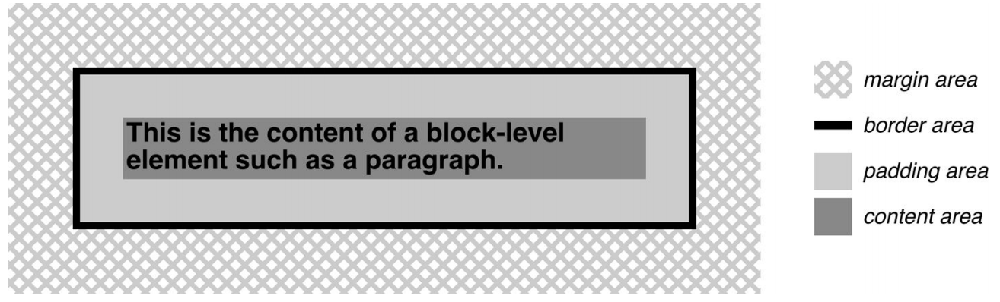
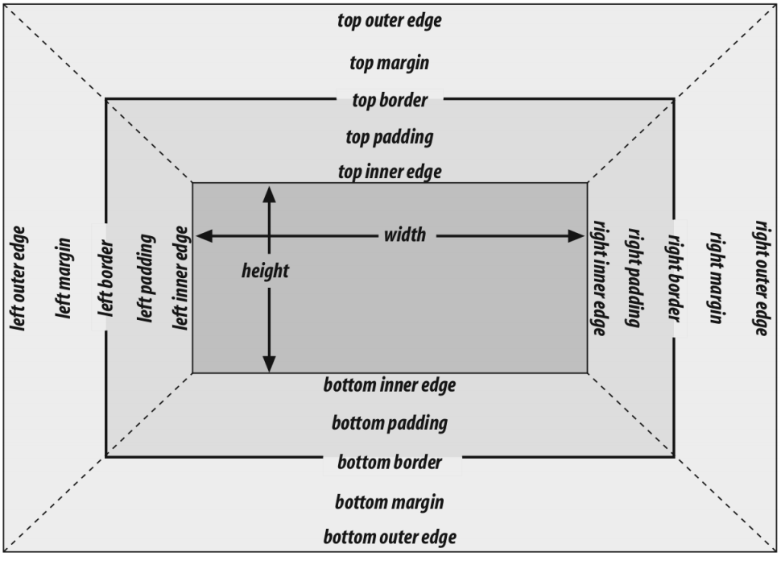
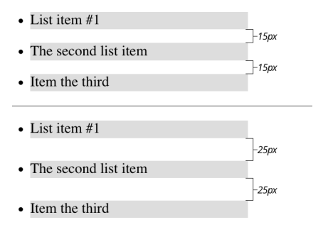
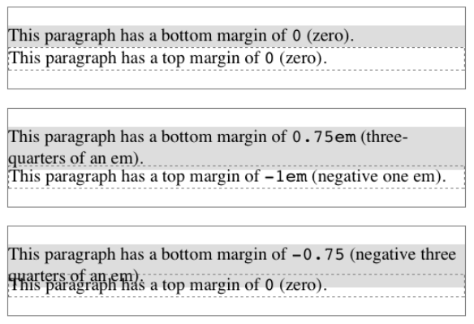

# 第07章 基本视觉格式

## 7.1 元素框基础

<div style="margin: 0 auto; width: 70%;">
  
</div>
<p align="center">图 7-1：The content area and its surroundings</p>

1. 所有元素都生成一个或多个矩形盒 element boxes

2. `background` 默认在 `padding-area`

3. border color 默认取前景色 text color

4. 普通流，从左向右、从上向下，非西语流的方向可能会不同

5. `inline-block` box 表现类似替换元素

6. containing block，每个元素盒有个包含块，layout context，通常是父元素盒

## 7.2 调整元素的显示方式

### 改变显示方式

在设计文档样式时，可以方便地更改元素生成的框的类型。例如，假设我们在一个导航中有一系列的链接，我们想把它们作为一个垂直的边栏:

```html
<nav>
  <a href="index.html">WidgetCo Home</a>
  <a href="products.html">Products</a>
  <a href="services.html">Services</a>
  <a href="fun.html">Widgety Fun!</a>
  <a href="support.html">Support</a>
  <a href="about.html" id="current">About Us</a>
  <a href="contact.html">Contact</a>
</nav>
```

我们可以把所有的链接放到表格单元格中，或者把每个链接都包装在它自己的导航中，或者我们可以让它们都是块级元素，就像这样:

```css
nav a {
  display: block;
}
```

这将使导航导航中的每个元素成为块级元素。

### 7.2.2 块级框

默认情况下，块框的宽度定义为从左内边到右内边的距离，高度定义为从内顶到内底的距离。这两个属性都可以应用于生成块框的元素。

<div style="margin: 0 auto; width: 70%;">
  
</div>
<p align="center">图 7-4：The complete box model</p>

也可以使用属性 `box-sizing` 属性改变这些属性的处理方式。

1. 取值： content-box | padding-box | border-box

2. 这个属性用来改变width和height的具体意义。

### 7.2.14 折叠纵向外边距

纵向格式化的另外一个重要特指是，相邻的纵向外边距会折叠。只有外边距有这种折叠行为。内边距和边框，不会折叠。

```css
 li {
  margin-top: 10px;
  margin-bottom: 15px;
}
```


<div style="margin: 0 auto; width: 70%;">
  
</div>
<p align="center">图 7-24：Collapsed versus uncollapsed margins</p>

### 7.2.15 负外边距和折叠

负外边距确实会对垂直格式产生影响，并影响页边距的折叠方式。如果设置了负的垂直边距，那么浏览器应该取两个边距的绝对最大值。然后从正保证金中减去负保证金的绝对值。换句话说，负的和正的相加，得到的值就是元素之间的距离。图 7-27 提供了两个具体的例子。

<div style="margin: 0 auto; width: 70%;">
  
</div>
<p align="center">图 7-27：Examples of negative vertical margins</p>

Notice the “pulling” effect of negative top and bottom margins. This is really no different from the way that negative horizontal margins cause an element to push outside of its parent. Consider:
