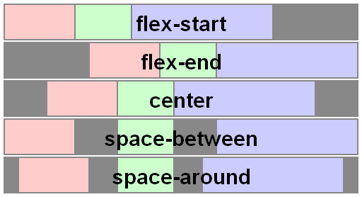

# 第12章 flex布局

## 12.1 基础

1. 弹性盒依赖父子关系，在元素上声明 display：flex 或 display：inline-flex，这个元素成为弹性容器。

## 12.2 弹性容器

### flex-direction

1. 取值 row|row-reverse|column|column-reverse

2. 定义布局

### flex-wrap

1. 取值 nowrap|wrap|wrap-reverse
2. 作用：限制弹性容器只能显示一行还是可以换行显示，wrap|wrap-reverse 决定多出的行是显示在第一行之前还是之后

### flex-flow

1. flex-direction和flex-wrap的简写

   ```css
   flex-flow：column-reverse warp；
   flex-flow：warp column-reverse；
   ```

## 12.5 调整内容

### justify-content

取值：

1. `flex-start`：
   - 默认值，子元素将会在 Flex 容器的起始位置对齐。
   
2. `flex-end`：
   - 子元素将会在 Flex 容器的末尾位置对齐。
   
3. `center`：

   - 子元素将会在 Flex 容器的中间位置对齐。

4. `space-between`：

   - 子元素会在 Flex 容器内均匀分布，第一个子元素在起始位置，最后一个子元素在末尾位置。

5. `space-around`：

   - 子元素会在 Flex 容器内均匀分布，两侧的间隔会是相邻子元素之间间隔的一半。

6. `space-evenly`：

   - 子元素会在 Flex 容器内均匀分布，所有间隔相等。

7. `stretch`：
- 默认情况下，子元素会被拉伸以填充整个 Flex 容器的高度（如果在主轴方向上是 `row`）或者宽度（如果在主轴方向上是 `column`）。

##### 几种布局的效果


## 12.6 对齐元素

### align-items

1. 取值：flex-start | flex-end |center | baseline | stretch  初始值 stretch

2. 作用 影响垂向的对齐方式

3. baseline：会使得各个item的基线对齐。基线是指文本元素的基准线，通常是字母的底部

   

    

## 12.7 align-self 

1. 取值： auto | flex-start | flex-end | center | baseline | stretch ,初始值 auto
2. align-items是定义在弹性容器的所有弹性元素上的，单个弹性元素可以用align-self属性覆盖

## 12.8 对齐内容 align-content

1. 取值： flex-start | flex-end | center | space-between | space-around | space-evenly | stretch    默认stretch    

2. **flex****布局align-items和align-content的区别**

   1、align-items是针对每一个子项起作用，它的基本单位是每一个子项，在所有情况下都有效果

   2、align-content属性是将flex子项作为一个整体起作用，它的基本单位是子项构成的行

   只在两种情况下有效果：

   ①子项多行且flex容器高度固定

   ②子项单行，flex容器高度固定且设置了flex-wrap:wrap

   

   主轴为 flex-deriction定义的方向，默认为row

   交叉轴跟主轴垂直即为column，反之它们互调

   **justfiy-content**：应用于flex容器，设置flex子项（flex items）在主轴上的对齐方式。

   不同取值的效果如下所示：

   

   **align-items**：应用于flex容器，设置flex子项在每个flex行的交叉轴上的默认对齐方式。

   不同取值的效果如下所示：

   

   

   **align-content**：只适用多行的flex容器（子项不止一行时该属性才有效果），它的作用是当flex容器在交叉轴上有多余的空间时，将子项作为一个整体（属性值为：flex-start、flex-end、center时）进行对齐。不同取值的效果如下所示：

   

## 12.10 适用于弹性元素的属性

弹性元素的属性有3个，flex-grow、flex-shrink、和flex-basis 简写 flex

### flex-grow（增长因子）

1. 取值 <number>  默认值 0 
2. 增长因子：如果增长因子非0，如果弹性容器有多余的空间，多出的空间将根据弹性元素非0的增长印章按比例分配给各个弹性元素。

### flex-shrink（缩减因子）

1. 取值 <number>  初始值1

2. 缩减因子：指的是空间不足以放下所有弹性元素的时候，当前弹性元素相对其他同辈弹性元素将缩小多少。

3. 规范指定人员不鼓励用flex-shrink来指定缩减因子，建议使用flex简写。

### flex-basis

1. 取值 content  |  <length>  |  <percentage>  初始值 auto

2. 它的初始值是 auto，此时浏览器会检查元素是否设置了 width 属性值。如果有，则使用 width 的值作为 flex-basis 的值；如果没有，则用元素内容自身的大小。如果 flex-basis 的值不是 auto，width 属性会被忽略。

   分为两种情况：
   **1.没有设置flex-basis，这时候flex-basis为默认值auto。**
   这种情况很常见，就是只设置了display:flex的时候。别的flex属性都没设置。此时浏览器会检查元素是否设置了 width 属性值。如果有，则使用 width 的值作为 flex-basis 的值；如果没有，则用元素内容自身的大小。 这句话暗含了一个很重要的信息就是在flex里面，flex-basis是优先用于处理宽度的。更切确的说，在flex里面，根本不存在width,如果用户没设置flex-basis的值，flex系统会把width的值赋值给flex-basis。flex-basis有了值后，width被忽略，变成了工具人。
   **2.设置了flex-basis的值，这时候width会忽略，元素的宽度用flex-basis的值表示。**
   这点就更加验证了在flex里面，flex-basis是优先于width来处理宽度的。在flex里面只要用户设置了flex-basis的值，我flex系统都不正眼瞧你width。
   总之，在设置了display:flex之后，你最好设置flex-basis的值，并且忽略width。 虽然width也是可以用，但就显得拖泥带水。就像你一只脚已经踏入我flex这个先进的布局系统里面，另一只脚还停留在原始的CSS里面。既然你已经用了flex这个系统，用就用全套，就用我flex-basis吧。而且我还可以和我另两个兄弟flex-grow 和 flex-shrink一起配合使用。组成flex三巨头。
   虽然说flex-basis是替换了width,并且他和width起到的作用是差不多的。但他们还是不同的。
   当width为0的时候，我们是看不到元素的。但当flex-basis为0,或者为auto并且width没有设置值的时候(默认值为0)，该元素的大小是由内容大小决定的。也就是只要有内容，flex-basis是不会看不到元素的。这在后面会从例子中体现。

   设为auto和0也是有区别的。一个最明显的区别就是为0的时候，如果内容文字有空格是自动换行的。
   这个可以通过设置white space:nowrap解决。auto就没有这个问题

### flex

1. 取值 [ <flex-grow> <flex-shrink> ? || <flex-basis> ] | none
2. 初始值 0 1 auto
3. flex:initial 等价于 flex: 0 1 auto;
4. flex:auto 等价于 flex: 1 1 auto ;
5. flex:none 等价于 flex: 0 0 auto;

## 12.16 order 属性

1. 取值 <integer>  初始值 0
2. 默认情况下 order都为0，如果order设置了非0整数，order为负数的在前面，order为正数的在后面
